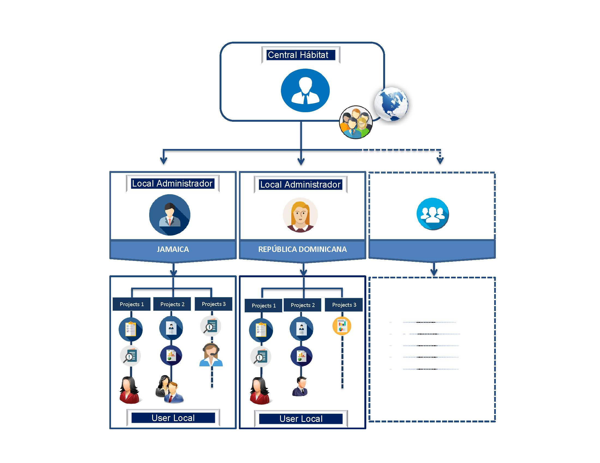

# Empezando a Conocer el Sistema SGIT

### 1. Cómo está estructurado SGIT

El Sistema SGIT, es una herramienta diseñada principalmente para las organizaciones regionales de Hábitat para la Humanidad, permitiéndoles a estas poder gestionar de forma mas optima los proyectos para la regularización de la tierra.

#### La estructura de la plataforma soporta 3 perfiles necesarios que es importante que el usuario conozca.



Administra el Sistema de forma íntegra y es responsable de crear los administradores Locales para los países de la región \(País\) .



Usuario con acceso Administrativo  solo a su país local y encargado de crear nuevas organizaciones locales y agencias en el Pais.



Los usuarios locales corresponden a un Municipio o Agencia y son los siguientes:

Usuario Administrador de Local \(Agencia o Municipio\) : Corresponde al usuario que administra los accesos del sistema en dicha agencia y municipio.

Usuario Planificador: Corresponde al Usuario encargado de la Planificación y Configuración  del Sistema previo a la Creación de los Proyectos. 

Usuarios operativo: Corresponde al Usuario encargado de la ejecución de los proyectos, ademas de los encargados en registrar los datos al Sistema. 

Ademas de estos usuarios el usuario Local Administrador puede crear usuario de consulta.



**En el Siguiente Grafico se muestra los niveles de acceso según lo descrito anteriormente**

