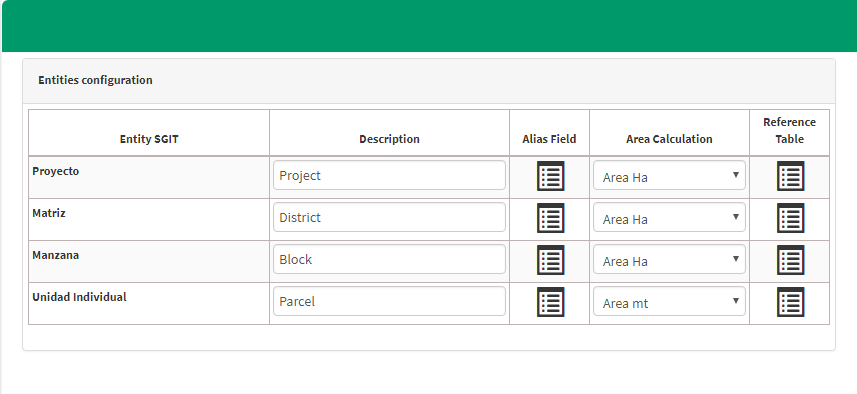

# Estándar de entidades

El usuario de administrador de país puede configurar y segmentar las unidades territoriales como proyecto, distrito, manzana y lote para cada gestión con su respectivo tipo de medición como hectáreas o metros cuadrados.

Guardamos las configuraciones realizadas.

